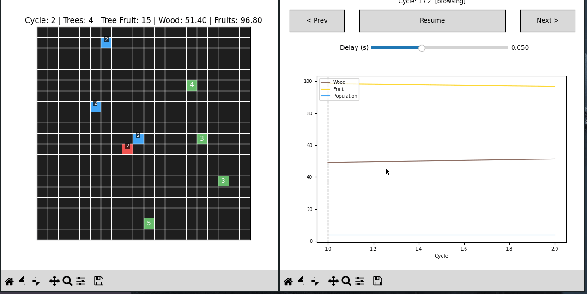

# ki-arena
SoSe2026 KI Praktikum Agent Arena Projekt



## Gruppenteilnehmer

- Daniil Khoma
- Haron Nazari
- Anton Tchekov

## Bedienungsanleitung

### Projektorientierung

Der gesamte Code liegt unter `src/sim/`, Einstiegspunkt ist `main.py`.

- **`environment/`** – Simulationsumgebung: Spielwelt, Regeln, Ressourcen und Visualisierung.
- **`agents/`** – Die Agententypen: regelbasiert, RL und LLM.
- **`arena/`** – Ablaufsteuerung der Simulation (Phasen und Episoden).
- **`analysis/`** – Auswertung und Protokollierung der Läufe.
- **`llm/`** – Anbindung an ein Sprachmodell über die Mistral API.

### Projekt starten

Abhängigkeiten installieren:
```
pip install -r requirements.txt
```

Richtiges Verzeichnis betreten und ausführen:
```
cd src/sim
python main.py
```

Standardmäßig laufen Regel-Agenten (keine API nötig). Für LLM-Agenten wird die
Mistral-API genutzt; dazu den API-Key als Umgebungsvariable setzen:
```
export MISTRAL_API_KEY=dein_key
```

### Headless (ohne GUI)

Für reproduzierbare Experimente und als Notfallplan für die Demo gibt es einen
Headless-Runner ohne Fenster und ohne Eingaben:
```
cd src/sim
python run_headless.py --agents greedy --seeds 1-3
python run_headless.py --agents greedy --seeds 1-3 --set tree_spawn_rate=0.9
python run_headless.py --agents rl --train-episodes 300 --seeds 1
MISTRAL_API_KEY=… python run_headless.py --agents llm --llm-backend mistral --set max_cycles=600
```
Mit `--save` wird der Lauf als Replay in `saves/` gespeichert (plus eine `.txt`-Notiz).
Interessante Parameter-Einstellungen sind in `src/sim/simulation_parameters.txt`
dokumentiert, die zugehörigen Ergebnisse in `docs/labnotebook.md` und
`docs/experiment.md`.

### Replays

Jeder Lauf wird nach `src/sim/saves/run-NNN.bin` geschrieben (gzip-komprimiert, die
verwendete Konfiguration ist mitgespeichert). Beim Start zeigt das Programm rechts
immer ein Menü: „New live run“ plus die Liste der gespeicherten Läufe (oder ein
Hinweis, wenn es noch keine gibt).

- Ein Replay anklicken spielt den Lauf ab (Pause/Resume, Prev/Next oder Klick in den
  Graph zum Springen). Der Speed-Regler wird im Replay zu „Cycles/s“ und steuert das
  Abspieltempo (bis 240 Zyklen/s).
- „New live run“ startet eine neue Simulation, und zwar pausiert. Mit Resume läuft sie
  durch, mit Next (im pausierten Zustand) geht sie Zyklus für Zyklus weiter.

Einige interessante Läufe sind fest im Repo abgelegt und semantisch benannt – z. B.
`greedy-0.3-boom.bin` / `greedy-0.3-bust.bin` (Boom-oder-Bust bei `tree_spawn_rate=0.3`),
`greedy-0.1-collapse.bin` / `greedy-0.1-woodfix.bin`, `rl-collapse.bin` und
`llm-coordination.bin`. Neben jedem liegt eine gleichnamige `.txt`, die erklärt, warum
der Lauf interessant ist. Diese lassen sich direkt im Replay-Menü abspielen.

### Dokumentation

- `docs/projektdokumentation.md` – Gesamtdokumentation (Motivation, Architektur, Design, Evaluation, Limitationen)
- `docs/experiment.md` – Hypothese, Versuchsaufbau und Ergebnisse
- `docs/metriken.md` – verwendete Metriken
- `docs/labnotebook.md` – Beobachtungen aus Durchläufen
- `docs/edgecases.md` – Edge Cases und Fehlerbehandlung
- `docs/reflexion.md` – Reflexion
- `docs/demo.md` – Ablauf der Live-Demo
- `docs/slides.md` – Präsentationsfolien
- `docs/transparenz.md` – Hinweis zur Nutzung von Coding-Assistenten

## Projektbeschreibung

Im Projekt soll ein Spiel umgesetzt werden, in dem mehrere
gleich große Teams, bestehend aus mehreren KI-Agenten in
einer Arena Ressourcen verwenden müssen. Das Spielfeld ist eine
Top-Down Karte mit einem rechteckigem Grid, auf dem sich
die Agenten bewegen können.

Die Felder auf dem Spielfeld haben verschiedene Eigenschaften,
unter anderem Ressourcenfelder, die Agenten erreichen und
je nach ihrer Rolle verwenden müssen.

Die Agenten haben eine begrenzbare Sicht auf das Spielfeld,
und verschiedene Ziele. Das Ziel ist das in der Simulation
alle Teams in einem bestimmten Maße kooperativ handeln,
und sich eine Balance herausbildet, jedoch jede Gruppe
von Agenten trotzdem ihre eigenen Interessen verfolgt.

### Agenten

Es sollen einfache Regelbasierte Agenten, RL-Agenten und LLM-Agenten
miteinander verglichen werden.

Es gibt aktuell zwei Gruppen von Agenten in der Simulation, einmal die
Holzfäller, die Bäume fällen, und die Früchtesammler, die von den Bäumen
Früchte sammeln. Das Ziel ist, dass idealerweise die Agenten so handeln,
dass die Ressourcen der Spielwelt erhalten bleiben, und gleichermaßen
die Bedürfnisse der Agenten an Holz und Früchten erfüllt sind.

Zudem sollen in einer Weiterentwicklung weitere Agenten hinzugefügt werden,
welche andere Ziele verfolgen, die auch (teilweise) in Konflikt zu den Zielen
der anderen Agenten stehen.

### Architektur

