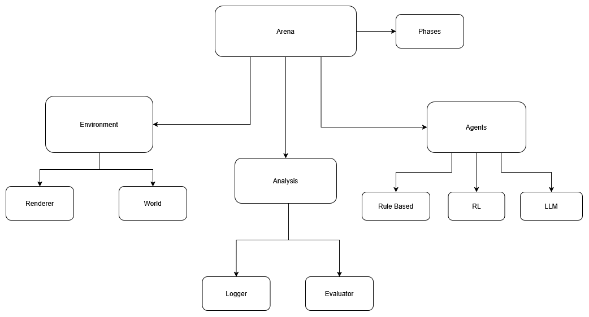

# Ki-Arena – Projektdokumentation

Gruppe HAD · Anton Tchekov, Daniil Khoma, Haron Nazari · HAW Hamburg

## 1. Motivation und Zielsetzung

Ki-Arena ist eine Grid-Welt, in der KI-Agenten um geteilte Ressourcen leben. Zwei
Rollen teilen sich einen Wald: Collector sammeln Früchte, Cutter fällen Bäume für
Holz. Jeder Agent braucht beides, und beides kommt aus demselben Wald.

Das erzeugt Spannung: Jede Rolle will ihr eigenes Ziel, aber wenn alle nur zugreifen,
kippt das System und alle sterben. Uns interessiert, ob sich aus einfachen Regeln eine
Balance ergibt und wie sich Regel-, RL- und LLM-Agenten dabei schlagen.

Ziel: eine lauffähige Simulation mit klaren Regeln, drei vergleichbare Agenten-Typen,
und Werkzeuge, um zu sehen, warum ein Lauf so ausgeht (Logs, Graphen, Metriken).

## 2. Architekturüberblick

Code unter `src/sim/`, Einstieg `main.py`. Bausteine:

- **environment/** – die Welt. `world_grid.py` (Positionen, Bäume, Bewegung),
  `resource_manager.py` (Holz/Frucht, Verbrauch), `env_grid.py` (PettingZoo-Umgebung:
  Schritte, Spawn, Tod), `config.py` (alle Stellschrauben), `renderer.py` +
  `control_panel.py` (Anzeige).
- **agents/** – `rule_agent.py`, `rl_agent.py` (Q-Learning), `llm_agent.py`,
  `blackboard.py` (gemeinsame Tafel für LLM-Kommunikation).
- **arena/** – `runner.py` (führt eine Episode aus), `phases.py` (Training/Ausführung).
- **analysis/** – `statistics.py`, `run_logger.py`, `llm_logger.py`, CSV-Logger.
- **llm/** – Anbindung an Ollama oder die Mistral-API.

Ablauf: Der Runner fragt jeden Agenten der Reihe nach (`act`), die Umgebung führt die
Aktion aus und vergibt Belohnung. Am Ende eines Zyklus folgt der globale Schritt:
Bäume wachsen, Ressourcen werden verbraucht, bei genug Vorrat spawnt ein neuer Agent,
und Agenten sterben an Alter oder Mangel.

Bezug zur Vorlesung: Regel-Agent = Simple Reflex, RL/LLM = lernend. Memory liegt in
der Q-Tabelle (RL) bzw. im Blackboard und Kontext (LLM), Action ist Bewegen/Interagieren.

## 3. Designentscheidungen

- **PettingZoo (AEC).** Standard für Multi-Agenten, gibt uns Reihenfolge, Termination
  und Spaces gratis.
- **ResourceManager getrennt von der Welt.** Ressourcen-Bilanz an einer Stelle, Grid
  bleibt schlank.
- **Alles über `config.py`.** Eine Konstante ändern reicht für ein Experiment.
- **Gleiche `act()`-Schnittstelle für alle Agenten.** Regel, RL, LLM sind austauschbar.
- **Blackboard als Klartext.** Lesbar für Mensch und Modell.
- **Geometrie fürs LLM vorberechnen.** Kleine Modelle navigieren ein Grid nicht gut,
  also geben wir einen konkreten Hinweis plus Fallback-Aktion.
- **Robustes Parsing.** Bei ungültiger Antwort greift die Fallback-Aktion.
- **Ein Matplotlib-Fenster** (Grid + Control Panel). Auf Wayland ließ sich die Position
  zweier Fenster nicht setzen, eine Figur löst das.
- **Logfile pro Lauf überschrieben.** Konfig-Kopf einmal, dann knappe Ereignisse.

## 4. Evaluation und Ergebnisse

Details in `docs/experiment.md`, Metriken in `docs/metriken.md`.

Hypothese: Der Wald-Nachwuchs (`tree_spawn_rate`) entscheidet über das Überleben.
Vier Werte, je 3 Seeds, headless mit Regel-Agenten:

| tree_spawn_rate | Zyklen | Schnitt-Pop | Todesursache |
|-----------------|--------|-------------|--------------|
| 0.1             | 105    | 5.0         | Holzmangel   |
| 0.3             | 200    | 5.0         | Alter        |
| 0.5 (Standard)  | 467    | 6.0         | Alter        |
| 0.9             | 688    | 7.3         | Alter        |

Bestätigt: schnellerer Wald = längeres Überleben. Bei 0.1 kollabiert das System durch
Holzmangel.

Iteration: Gegen den Kollaps half eine Cutter-Schonregel nicht (Engpass ist der
Holz-Durchsatz, nicht die Zahl der Bäume). Mehr Holz pro Baum (5 → 10) half: niemand
verhungert mehr. Überraschung: bei Standard-Werten stirbt die Gruppe an Alter, nicht
an Hunger, weil die Frucht selten über die Spawn-Schwelle kommt.

## 5. Limitationen und Failure Modes

- Kein Fallback, wenn API-Key fehlt oder Ollama nicht läuft (nur LLM-Läufe betroffen).
- Volle Sicht statt Teilwissen, also noch kein echtes POMDP.
- Sehr config-empfindlich, kleine Änderungen, große Wirkung.
- LLM-Läufe sind langsam und kosten Tokens, daher evaluieren wir mit Regel-Agenten.
- Edge Cases stehen mit Lösung in `docs/edgecases.md`.

## 6. Mit mehr Zeit

- Teilwissen (Sichtradius) einbauen.
- LLM, RL und Regel in denselben Läufen direkt vergleichen.
- API robuster machen (Timeout, Retry, Fallback).
- Mehr Rollen mit gegensätzlichen Zielen für echte Aushandlung.
- Experiment-Runner, der Varianten selbst fährt und die Tabellen erzeugt.
